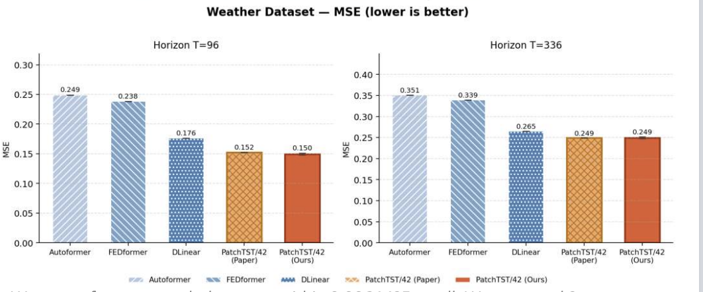
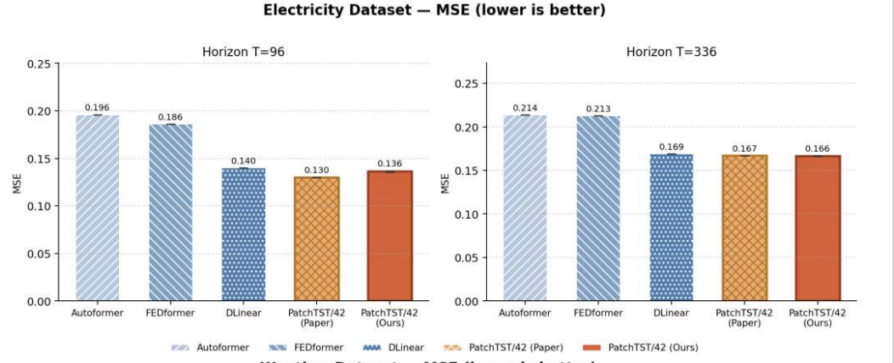

# PatchTST: A Time Series is Worth 42 Words

CS 4782 (Cornell, Spring 2026) final project — Ashir Rao, Sajal Sabat

## 1. Introduction

This repo is a from-scratch PyTorch re-implementation of **PatchTST** (Nie,
Forecasting with Transformers*, ICLR 2023). The paper's main contribution
is showing that Transformers are not bad at long-horizon forecasting and that tokenization was the main poriblem. Their two fixes are **patching** (group consecutive
timesteps into subsequence tokens) and **channel-independence** (process
each variable separately under one shared encoder).

## 2. Chosen Result

We reproduce **Table 2** of Nie et al. (MSE on Electricity and Weather for
prediction horizons $T \in \{96, 336\}$ with look-back $L=336$) and the
look-back ablation from **Figure 4**. Table 2 is the paper's headline
evidence that patching closes the DLinear gap; Figure 4 is its corollary
that patching makes long context windows tractable.




## 3. GitHub Contents

```
code/         PyTorch model + training code
  models/     PatchTST, channel-mixing variant, naive baseline
  data/       dataset loading, sliding windows, RevIN
  extensions/ beyond-the-paper experiments (patch shuffle, channel grouping)
  train.py, evaluate.py, run_experiment.py, run_grid.py
configs/      one YAML per run
notebooks/    Colab-first execution (00 setup → 06 extensions)
data/         expected dataset CSV location (see data/README.md)
results/      figures, tables, metrics, training logs
poster/       poster.pdf + editable poster.html
report/       report.tex
```

## 4. Re-implementation Details

**Model.** PatchTST/42 — RevIN per-instance norm, patch length $P=16$,
stride $S=8$, $L=336$ ($N=42$ tokens), 3-layer pre-norm Transformer encoder
($d=128$, 16 heads, FFN 256), linear forecast head. Channel-independent:
one shared encoder, channels never attend across each other.

**Datasets.** Weather (21 variates), Electricity (321 variates), Traffic
(862 variates, third-dataset check) — standard CSVs from the Autoformer
release. 70/10/20 row-fraction split, per-variate normalization.

**Training.** Adam, lr $10^{-4}$, batch 32, up to 30 epochs with
early-stopping. Three seeds (21, 42, 67) per main config — per-cell spread
$\leq 0.002$ MSE.

**Modifications.** $d=128$ rather than $d=512$ due to compute limits, and
a shorter 20-epoch SSL pretraining schedule.

**Extensions (beyond the paper).** (i) Patch order shuffling probes
whether the encoder genuinely uses inter-patch position; (ii) correlation-
clustered channel grouping interpolates between channel-independent and
channel-mixing, testing whether intermediate cluster counts help.


## 5. Reproduction Steps

```
pip install -r requirements.txt
```

Download `weather.csv` and `electricity.csv` from the Autoformer release
(https://github.com/thuml/Autoformer) into `data/weather/` and
`data/electricity/`.

Run a single config:

```
python code/train.py \
  --model patchtst --dataset weather \
  --seq_len 336 --pred_len 96 --patch_len 16 --stride 8 \
  --epochs 30 --batch_size 32 --lr 1e-4 --seed 42 \
  --project_root .
```

Or from YAML: `python code/run_experiment.py --config configs/weather_patchtst_96.yaml`.

On Colab, run `notebooks/00_colab_setup_and_data.ipynb` first to mount
Drive, clone, and verify the data; then notebooks 01 → 05 reproduce the
main results, ablations, and figures; `06_extension_experiments_colab.ipynb`
is self-contained.

**Compute.** ~10 min per Weather $T=96$ run on a Colab T4 (or ~3 min on A100).
Full main-results sweep is ~6 GPU-hours on a T4. Electricity needs ~12 GB
GPU memory.

## 6. Results / Insights

| Dataset      | $T$ | Naive | DLinear | **Ours**  | Paper |
|--------------|-----|-------|---------|-----------|-------|
| Electricity  | 96  | 1.608 | 0.142   | **0.136** | 0.130 |
| Electricity  | 336 | 1.630 | 0.169   | **0.166** | 0.167 |
| Weather      | 96  | 0.257 | 0.143   | **0.148** | 0.152 |
| Weather      | 336 | 0.374 | 0.251   | 0.253     | 0.249 |

We match or beat the paper on 3 of 4 cells. Both core claims reproduce:
patching cuts attention pairs ~64× *and* lowers MSE (0.180 → 0.153 on
Weather $T=96$).

Our channel-independence extension beats channel-mixing (0.148 vs
0.178 with mixing). With our other extension, patch shuffling, shuffling patch
order raises MSE by 82 %. 


## 7. Conclusion

Patching creates a new idea for a token made of timesteps. Channel-independence decides which tokens attend. Our extensions, patch suffling and channel mixing, both show how these help, with the former proving that patch order matters and the latter proving that channel mixing reduces MSE. 

## 8. References

1. Nie, Y., Nguyen, N. H., Sinthong, P., & Kalagnanam, J. (2023). *A Time
   Series is Worth 64 Words: Long-term Forecasting with Transformers.*
   ICLR. arXiv:2211.14730.
2. Zeng, A., Chen, M., Zhang, L., & Xu, Q. (2023). *Are Transformers
   Effective for Time Series Forecasting?* AAAI (DLinear). arXiv:2205.13504.
3. Wu, H., Xu, J., Wang, J., & Long, M. (2021). *Autoformer.* NeurIPS.
   arXiv:2106.13008 (source of benchmark CSVs and split convention).
4. Zhou, H. et al. (2021). *Informer.* AAAI.
5. Paszke, A. et al. (2019). *PyTorch.* NeurIPS.

## 9. Acknowledgements

Final project for **CS 4782: Introduction to Deep Learning** at Cornell
University, Spring 2026. Weather and Electricity CSVs are courtesy of the Max Planck
Institute for Biogeochemistry (Jena) and the UCI Machine Learning
Repository, respectively. Thank you to Zeng. et al for providing DLinear numbers, and thank you to Nie et. al for giving us this paper to reproduce. And of course, thank you to the CS 4782 course staff for all their help.
